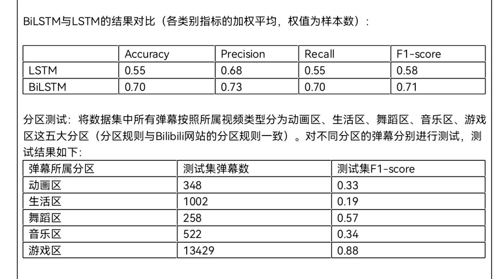

# 弹幕情感分类

## 运行方法

先运行data_preprocess.ipynb，得到预处理后的数据集，在运行BiLSTM.ipynb或LSTM.ipynb进行训练与测试

## 数据集

数据集来源：https://github.com/MelkiorOno/DanmakuMarked-data

数据使用utf-8编码，逗号分隔的csv保存

数据分为数字信息、文本信息、标注分类（未标注数据无标注信息）

数字信息包含：弹幕在视频中出现的时间点、展示模式、字号、字体颜色、发送时间、弹幕池编号、发送用户编号、在弹幕数据库中的编号，信息用逗号分隔

标注类别：0高兴、1难过、2愤怒、3惊讶、4负样本

## 算法流程

### 数据预处理

- 去除空值、异常值
- jieba分词
- word2vec
- 标签onehot编码

### 模型定义

- LSTM
- BiLSTM

### 测试结果

